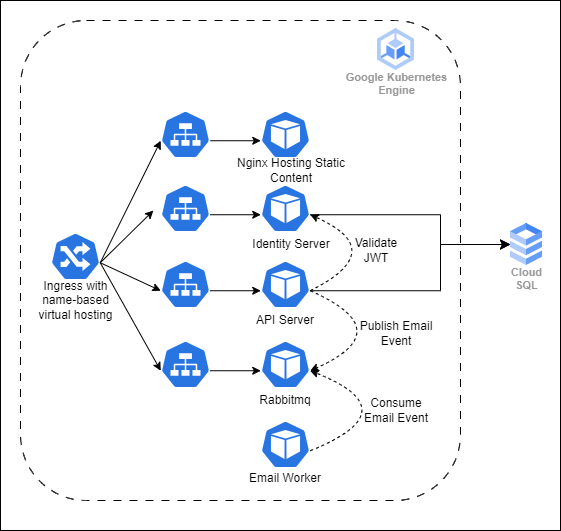

# To-do App

This application is built with intention to self-learn web development. Tech stacks involved include react and asp.net. User could use the app to arrange or plan to-do task.

## Feature

- create, update and delete to-do task
- search task by task title
- sort task list by task title, due date and priority
- filter task by task label, due date, priority
- light/dark mode toggle
- user login
- email notification

## Architecture (as deployed in GKE)

## Future Improvement

- add push notification feature to remind user about the task due date.
